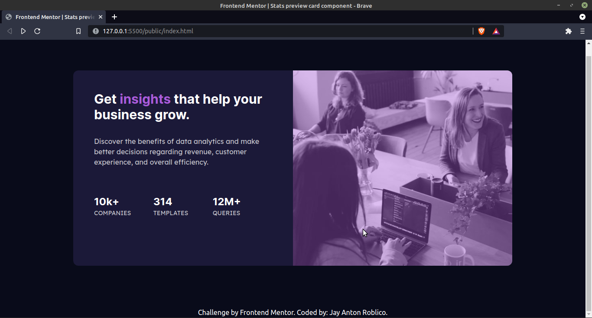

# Frontend Mentor - Stats preview card component solution

This is a solution to the [Stats preview card component challenge on Frontend Mentor](https://www.frontendmentor.io/challenges/stats-preview-card-component-8JqbgoU62). Frontend Mentor challenges help you improve your coding skills by building realistic projects. 

## Table of contents

- [Frontend Mentor - Stats preview card component solution](#frontend-mentor---stats-preview-card-component-solution)
  - [Table of contents](#table-of-contents)
  - [Overview](#overview)
    - [The challenge](#the-challenge)
    - [Screenshot on Desktop](#screenshot-on-desktop)
    - [Screenshot on Mobile](#screenshot-on-mobile)
    - [Links](#links)
    - [Built with](#built-with)
    - [What I learned](#what-i-learned)
  - [Author](#author)

**Note: Delete this note and update the table of contents based on what sections you keep.**

## Overview

### The challenge

Users should be able to:

- View the optimal layout depending on their device's screen size

### Screenshot on Desktop

### Screenshot on Mobile

### Links

- Live Site URL: [Demo](https://happy-tesla-9f4693.netlify.app/)

### Built with

- Semantic HTML5 markup
- Mobile-first workflow
- [Tailwind](https://tailwindcss.com/) - For styles

### What I learned

I learned to how use tailwind in mobile first workflow of designing UI.

## Author

- Website - [Jay Anton Roblico](https://jayantonroblico.tech)
- Frontend Mentor - [@saerdyey](https://www.frontendmentor.io/profile/saerdyey)
- Twitter - [@saerdyey](https://www.twitter.com/saerdyey)
